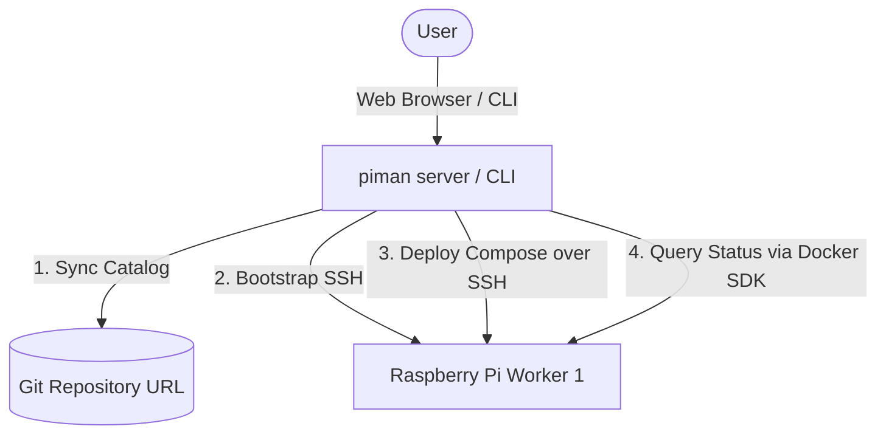

# piman 🖥️📦

> A lightweight, multi-node homeserver orchestrator designed for Raspberry Pi clusters.

`piman` is a modern tool to deploy, manage, and monitor home server applications across multiple remote worker nodes. It uses Docker Compose over SSH for lightweight service provisioning and queries container health in real-time via the Docker SDK. It comes with both a powerful CLI and a clean, premium, Notion-style web dashboard.

---

## Key Features

* **Subtle, Modern UI**: Designed with Notion-style aesthetics, glassmorphism, responsive navigation tabs, and crisp Lucide vector icons.
* **One-Click Catalog Deployments**: Instantly deploy cataloged services (like Pi-hole, Plex, Home Assistant, etc.) to target nodes.
* **SSH Key Bootstrapping**: Generate Ed25519 SSH keys and bootstrap authentication credentials on target worker nodes automatically.
* **Service Monitor**: Live container status dashboard showing container state, health, and stdout/stderr logs in a scrollable web terminal console.
* **Git Catalog Sync**: Synchronize and pull app catalog templates dynamically from any remote Git repository.
* **Docker Native**: Controls containers remotely via standard SSH tunnels, keeping worker nodes clean of heavy agent runtimes.

---

## System Architecture



---

## Installation & Setup

### 1. Quick Install (Recommended)
You can install `piMan` instantly on any Linux or Raspberry Pi machine using our interactive installer:
```bash
curl -fsSL https://pimanager.github.io/piman/install.sh | bash
```
The script automatically detects your platform and CPU architecture, downloads the latest pre-compiled release binary, initializes configuration folders, and prompts you if you intend to install the web management server as a background service (`systemd`).

### 2. Manual Build from Source
Cloning and compiling the single binary locally:
```bash
git clone https://github.com/sameerchandra/piman.git
cd piman
go build -o piman main.go
```

### 3. Initialize Configurations
Initialize the local configuration store directory (`~/.pistore`):
```bash
./piman init
```
This generates the base configuration files:
* `~/.pistore/nodes.yaml`: Your cluster node list configuration.
* `~/.pistore/keys/_ed25519/`: Directory where private SSH keys for connection targets are stored.

Configure your target nodes by editing `~/.pistore/nodes.yaml`:
```yaml
nodes:
  - name: pi-worker-1
    ip: 192.168.1.100
    username: pi
```

### 4. Synchronize the App Catalog
Pull the remote Git-based application catalog templates:
```bash
./piman sync -r https://github.com/sameerchandra/piman
```
*Note: If you run your own private or custom catalog repository containing folders with `metadata.yaml` and `docker-compose.yml`, you can pass your repository's URL instead.*

### 5. Launch the Server & Dashboard
Start the REST API server and serve the embedded Notion-style dashboard:
```bash
./piman serve --port 8080
```
Open `http://localhost:8080` in your web browser to access the dashboard workspace!

---

## CLI Command Reference

* **`init`**: Sets up `~/.pistore`, keys directory, and creates a template `nodes.yaml` file if they do not exist.
* **`sync -r <repoURL>`**: Clones/pulls the remote catalog Git repository. Automatically handles switching repository URLs or resolving corrupted caches by rebuilding the cache.
* **`serve [--port <port>]`**: Starts the Web UI server (default port `8080`).
* **`status --node <name>`**: Queries container statuses and diagnostics for a specified node.

---

## Project Structure

```
├── cmd/               # CLI commands (init, sync, serve, status)
├── pkg/
│   ├── api/           # API router & handler backend
│   │   └── frontend/  # Notion-style SPA web dashboard (HTML/CSS/JS)
│   ├── catalog/       # Git catalog caching & remote verification logic
│   ├── config/        # SSH keys generation, bootstrapping, and configuration loaders
│   ├── deploy/        # Docker Compose deployment executors
│   └── docker/        # Docker SDK status query handlers
├── main.go            # Entrypoint
└── go.mod             # Module dependencies
```

---

## Contributing

Please read [CONTRIBUTING.md](CONTRIBUTING.md) for details on code compilation, running local servers, and submitting pull requests.

## License

This project is licensed under the MIT License - see the [LICENSE](LICENSE) file for details.
